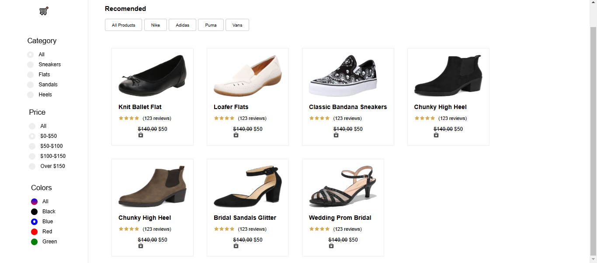

# Advanced Filtering

A web application that allows users to filter and search for shoes based on various criteria such as color, brand, and search input. This project demonstrates how to build an interactive filtering system with React.

## Features
- **Filter by Color**: Users can filter shoes based on available colors.
- **Filter by Brand**: Choose shoes from specific brands.
- **Search Input**: Users can search shoes by keywords.
- **Responsive**: The application is designed to work seamlessly across different screen sizes.
- **Deployed on GitHub Pages**: View the live version of the app [here](https://Kelsen23.github.io/Advanced-Filtering).

## Technologies Used
- **React**: JavaScript library for building user interfaces.
- **CSS**: Styling for layout and design.
- **Vite**: A fast build tool and development server.

## Screenshots

Here are some screenshots from the website:

## Getting Started

To run this project locally, follow these steps:

### Prerequisites
Ensure you have the following installed:
- Node.js (>=14.0.0)
- npm

### Clone the repository
git clone https://github.com/Kelsen23/Advanced-Filtering.git

### Install Dependencies
Navigate into the project directory and install the necessary dependencies:
cd Advanced-Filtering
npm install

### Run the app locally
npm run dev

## License
This project is licensed under the MIT License - see the [LICENSE](LICENSE) file for details.